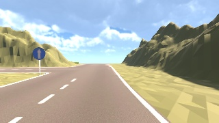
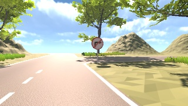
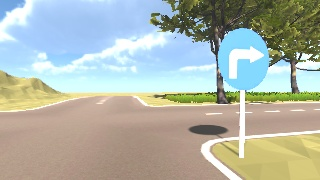
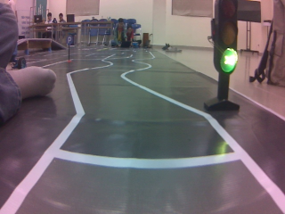
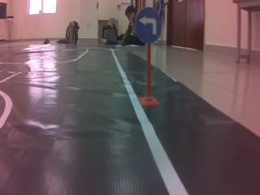
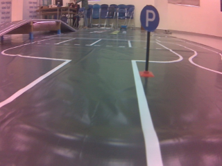

# UIT Car Racing 2024 – Professional Category

**Third Prize | 4-member team | Computer Vision / Perception & Vehicle Control**

An autonomous-driving project developed for **UIT Car Racing 2024 – Professional Category**.

The project combined computer-vision-based perception with lane-following and steering-control logic across multiple stages of the competition. Development involved both a simulated driving environment used during the online rounds and real-camera data collected while preparing for the physical final-round environment.

The repository is maintained as a **portfolio version of the original competition project**, containing selected control scripts, a sanitized YOLOv5 training notebook, and representative simulator / real-camera images.

---

## Project Overview

The vehicle needed to interpret the driving environment and generate appropriate steering behaviour under changing road conditions.

The project involved two main technical components:

1. **Perception**
   - Traffic-sign / driving-command recognition using YOLOv5
   - Image preparation and labelling
   - Simulator and real-camera data
   - OpenCV-based image processing

2. **Lane Following & Vehicle Control**
   - Road-centre estimation
   - Steering-angle generation
   - PID-based control
   - Kalman filtering
   - Dynamic speed adjustment
   - Additional tuning for sharp and 90-degree turns

The development process evolved from the simulator used in the earlier competition stages toward preparation for a physical vehicle using real-camera input.

---

## My Contribution

I worked primarily on the **computer-vision / perception side** of the project and also contributed to the lane-following and controller development.

My main contributions included:

- Preparing and labelling image data for the perception pipeline.
- Training a custom **YOLOv5** model for traffic-sign / driving-command recognition.
- Working with Python and OpenCV during the online autonomous-driving rounds.
- Contributing to the lane-following pipeline based on processed simulator frames.
- Supporting testing and controller tuning, particularly for sharp and 90-degree turns.
- Working as part of a **4-member team** throughout the competition.

This repository does **not** claim that every component of the competition system was developed solely by me. It documents the parts of the team project that I worked with and can explain.

---

# Perception System

## YOLOv5 Detection

A custom YOLOv5 detector was trained using a Roboflow-formatted dataset.

The preserved dataset configuration contains **6 classes**:

| Class |
|---|
| `left` |
| `no right` |
| `noleft` |
| `right` |
| `stop` |
| `straight` |

These classes represented traffic signs / driving commands relevant to the autonomous-driving environment.

---

## Training Configuration

The preserved training run used the following configuration:

| Parameter | Value |
|---|---:|
| Model family | YOLOv5 |
| Input image size | 416 × 416 |
| Batch size | 16 |
| Training epochs | 100 |
| Number of classes | 6 |
| Training environment | Google Colab / GPU |
| Dataset workflow | Roboflow |
| Framework | PyTorch / Ultralytics YOLOv5 |

The training command preserved in the project notebook was based on:

```bash
python train.py \
  --img 416 \
  --batch 16 \
  --epochs 100 \
  --data <dataset>/data.yaml \
  --cfg ./models/custom_yolov5s.yaml \
  --weights '' \
  --name yolov5s_results \
  --cache
```

---

## Preserved Training Results

Validation of the saved `best.pt` model produced:

| Metric | Result |
|---|---:|
| Precision | **0.751** |
| Recall | **0.900** |
| mAP@0.5 | **0.964** |
| mAP@0.5:0.95 | **0.716** |

The recorded validation set contained **35 images and 36 annotated instances**.

> **Important:** These results describe the preserved training/validation run only. They are **not official UIT Car Racing competition benchmarks**, and the validation sample is relatively small.

The model generated a saved `best.pt` checkpoint after training.

---

# Data Samples

The project involved two visually different environments:

- **Simulator data** used during the online qualification / semifinal stages.
- **Real-camera images** collected while preparing for the physical final-round environment.

This difference introduced a practical domain shift: simulated scenes were comparatively clean and controlled, while real-camera images contained different lighting, perspective, surface texture and environmental noise.

## Simulator Data

<p align="center">
  
  
  
</p>

The simulator provided a controlled environment for developing and testing perception and driving logic during the earlier rounds.

---

## Real-Camera Data

<p align="center">
  
  
  
</p>

These images were captured from a real camera during preparation for the physical competition environment.

They helped the team examine how perception behaviour developed in simulation would need to adapt to real-world visual conditions.

---

# Lane-Following Pipeline

Alongside the object-detection work, the controller processed simulator segmentation frames to estimate the road direction.

The general lane-following pipeline was:

```text
Segmentation Frame
        ↓
Grayscale Conversion
        ↓
Intensity Normalisation
        ↓
Road-Centre Sampling
at Three Image Checkpoints
        ↓
Road-Slope Estimation
        ↓
Steering Command
        ↓
Control / Smoothing
        ↓
Vehicle Command
```

The controller sampled the estimated road centre at **three image checkpoints** and used the resulting geometry to estimate road direction and generate steering commands.

---

## Why Grayscale?

The simulator could contain changes in lighting, road appearance and environmental visual information that were not necessarily useful for lane-centre estimation.

Converting the segmentation input to grayscale and normalising its intensity simplified the signal used by the lane-following logic.

This allowed the controller to focus more directly on road geometry rather than unnecessary colour variation.

---

# Steering & Control

Vehicle steering required more than simply detecting a road direction.

The controller also included mechanisms for reducing steering noise and adapting behaviour between relatively straight and curved road sections.

## PID Control

Separate PID settings were used for:

- straighter road sections;
- curved road sections.

This allowed the steering response to be adjusted according to the expected road behaviour rather than relying on one fixed set of control parameters for every situation.

---

## Kalman Filtering

A Kalman filter was used to smooth steering behaviour.

The objective was to reduce abrupt changes caused by noisy or rapidly changing measurements before commands were applied to the vehicle.

---

## Dynamic Speed Reduction

High steering changes indicated that the vehicle was entering a more demanding turn.

The controller therefore reduced speed dynamically when the steering change exceeded a threshold of approximately **17°**.

This was particularly relevant during testing of:

- sharp turns;
- 90-degree turns;
- situations where the vehicle risked overshooting the road boundary.

---

# Development Challenges

## 1. Sharp and 90-Degree Turns

One of the significant practical problems was **boundary overshoot** during aggressive turns.

At higher speeds, a steering correction could occur too late or be too aggressive, causing the vehicle to cross the road boundary.

The project therefore involved iterative testing of:

- steering response;
- separate straight / curve PID settings;
- Kalman smoothing;
- dynamic speed reduction.

---

## 2. Simulator-to-Real Transition

A second challenge was the difference between simulation and real-camera input.

Simulator images were visually cleaner and more predictable.

Real-camera data introduced additional variation such as:

- lighting differences;
- camera perspective;
- physical track texture;
- background objects;
- image noise;
- different sign appearance and scale.

The real-camera samples included in this repository represent the team's preparation for this transition rather than a claim that the complete final physical system is reproduced here.

---

## 3. Perception Dataset

The YOLOv5 model was trained for six traffic-sign / command classes.

Because the available validation set was relatively small, high mAP values should be interpreted as **project-development results rather than broad real-world generalisation benchmarks**.

This distinction is important when evaluating the model outside the original competition environment.

---

# Training Notebook

The repository contains a sanitized copy of the YOLOv5 training notebook:

```text
UIT_CarRacing_YOLOv5_Training_SANITIZED.ipynb
```

The notebook preserves:

- the YOLOv5 training workflow;
- model configuration;
- dataset configuration;
- training outputs;
- validation results;
- inference workflow.

The original workflow used:

- **Ultralytics YOLOv5**
- **PyTorch**
- **Roboflow**
- **Google Colab**

---

## Security Note

The original project notebook referenced a Roboflow API credential that belonged to a team collaborator.

That credential has been **removed from the public portfolio notebook**.

The sanitized notebook expects a user-provided environment variable:

```python
ROBOFLOW_API_KEY
```

The original private credential is intentionally **not included** in this repository.

Anyone wishing to rerun the Roboflow download step must provide their own valid Roboflow credentials and dataset access.

---

# Repository Structure

The portfolio repository currently contains the following main components:

```text
UIT-CARRACING/
│
├── README.md
│
├── Final.py
├── Test.py
├── UpdateLeftLane.py
├── UpdateMidLane.py
├── UpdateRightLane.py
│
├── UIT_CarRacing_YOLOv5_Training_SANITIZED.ipynb
│
└── assets/
    ├── real_camera_green_light.png
    ├── real_camera_left.png
    ├── real_camera_parking.png
    ├── simulator_01.jpg
    ├── simulator_02.jpg
    └── simulator_03.jpg
```

Additional historical development scripts may remain in the repository because this project was originally developed during the competition rather than created later as a clean standalone software package.

---

# Technologies Used

### Programming

- Python

### Computer Vision

- OpenCV
- YOLOv5
- Roboflow
- Image preprocessing
- Grayscale conversion
- Intensity normalisation

### Control

- PID control
- Kalman filtering
- Dynamic speed adjustment

### Development Environment

- Linux
- Google Colab
- PyTorch
- Ultralytics YOLOv5

---

# Competition Result

**UIT Car Racing 2024 – Professional Category**

**Third Prize**

The project was completed by a **4-member team**.

The competition provided an opportunity to work across:

- computer vision;
- autonomous vehicle control;
- simulation;
- real-camera perception;
- iterative system testing and tuning.

---

# What I Learned

The project was one of my first experiences working on a system where computer-vision output directly affected control behaviour.

The most important lessons were not limited to training a model.

I gained practical exposure to:

- preparing and labelling visual data;
- training and evaluating a custom object detector;
- reading model metrics critically rather than treating accuracy as the only measure of success;
- processing visual input with OpenCV;
- connecting perception information to steering logic;
- tuning control behaviour through repeated testing;
- dealing with sharp-turn instability and overshoot;
- recognising the difference between simulator performance and real-camera conditions;
- collaborating within a team on an engineering competition project.

The project also demonstrated that a model or controller that works in one environment may require substantial adaptation when the input conditions change.

---

# Limitations

This repository is intended as a **portfolio reconstruction of the 2024 project**, not as a complete redistribution of the original competition environment.

For that reason:

- the full competition simulator is not included;
- organiser-provided map/resources are not redistributed;
- the complete internal team dataset is not included;
- only representative simulator and real-camera samples are provided;
- original private Roboflow credentials have been removed;
- the preserved YOLO metrics come from the project validation run and should not be interpreted as official competition results;
- some original team resources may no longer be available.

The repository focuses on documenting the technical work and artifacts that can be responsibly presented as part of my engineering portfolio.

---

# Acknowledgements

This was a **team project**, and the competition result reflects the work of all four team members.

The computer-vision training workflow also built on open-source tools and resources from:

- [Ultralytics YOLOv5](https://github.com/ultralytics/yolov5)
- [Roboflow](https://roboflow.com/)
- [OpenCV](https://opencv.org/)

Their tools were used as part of the project development workflow.

---

# Author

**Diep Khai Hoang**

Computer Engineering Undergraduate  
University of Information Technology, Vietnam National University Ho Chi Minh City  
**UIT-VNU-HCM**

Areas of interest:

- Embedded Systems
- Computer Vision
- Autonomous Systems
- Hardware–Software Integration
- Computer Systems Engineering

---

> This repository is maintained for academic and portfolio purposes.
